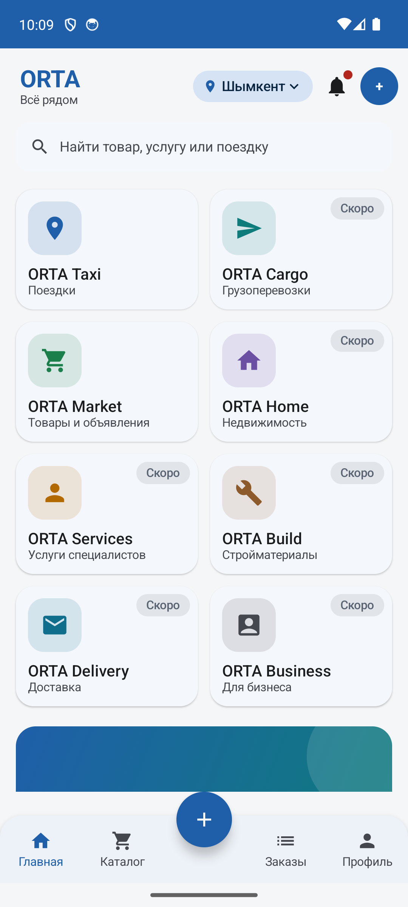
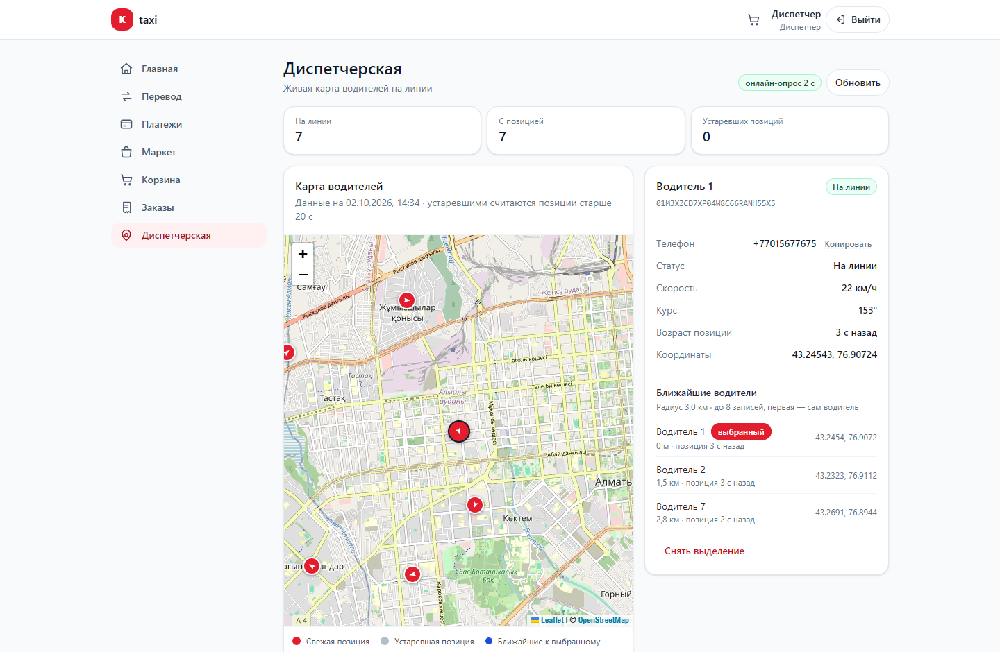
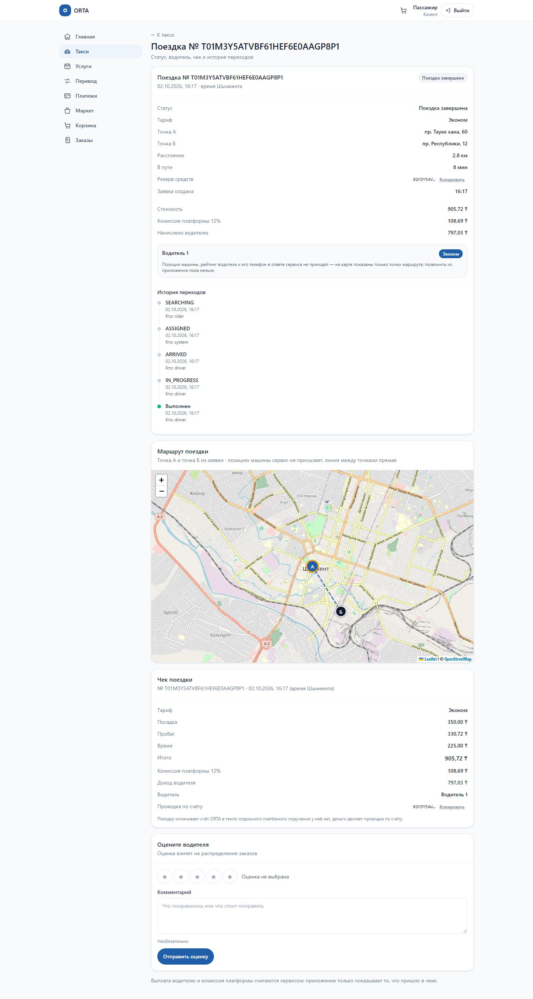
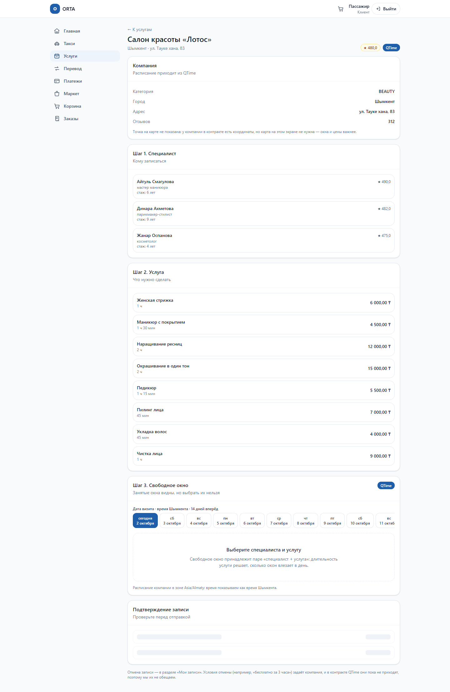

# ORTA — всё рядом

ORTA — универсальный суперапп для Казахстана: **пятнадцать направлений** — такси,
грузоперевозки, автосервис, доставка, маркетплейс, стройматериалы, аренда,
недвижимость, услуги, beauty, здоровье, работа, еда, билеты и кабинет для бизнеса —
поверх **пяти платформенных сервисов** (ORTA ID, Pay, Wallet, Map, AI) и сквозных
механизмов: общий аккаунт, общие деньги, общая карта, общие уведомления и рейтинг.
Идея ORTA — единая цифровая экосистема, где пользователю не нужно устанавливать
десятки разных приложений.

Монорепозиторий: микросервисы на Java 17 / Spring Boot, React-фронтенд, нативный
Android-клиент на Kotlin + Jetpack Compose и локальная инфраструктура в docker-compose.
Что за продукт, из каких направлений состоит и на чём держится внутри —
[`docs/orta.md`](docs/orta.md).

Первая вертикаль — **ORTA Taxi**. Она выбрана не случайно: райд-хейлинг заставляет
решать самое дорогое — деньги нельзя терять и нельзя начислять дважды, водитель не
может быть назначен на две поездки, позиция машины живёт секунды, а оффер —
пятнадцать. Остальные сервисы ORTA встают на ту же платформу: общий леджжер с
двойной записью, идемпотентность на уровне БД, события через транзакционный outbox,
роли в JWT и единый контракт ошибок RFC 7807.

| Домен | Направления | Состояние |
|---|---|---|
| Транспорт | ORTA Taxi, ORTA Cargo, ORTA Auto, ORTA Delivery | Taxi работает, проверено на живом стеке: водители с документами, выход на линию, геопозиции, живая карта диспетчера, заказ поездки (котировка, подбор машины, резерв и списание денег, чек). Остальное — план |
| Товары | ORTA Market, ORTA Build, ORTA Rent | Market работает, проверено e2e: витрина, корзина, оформление, комиссия, выплаты. Остальное — план |
| Недвижимость | ORTA Home | План |
| Услуги | ORTA Services, ORTA Beauty, ORTA Health, ORTA Jobs | Services работает, проверено на живом стеке: компании, специалисты, услуги, расписание, свободные окна и записи — это ядро QTime. Beauty/Health/Auto подключаются к нему же, а не строят свой календарь |
| Еда и развлечения | ORTA Food, ORTA Tickets | План |
| Бизнес | ORTA Business, QTime CRM | Кабинет продавца, продажи и выплаты работают, проверено e2e; CRM и расписание — план |
| Платформа | ORTA ID, ORTA Pay, ORTA Wallet, ORTA Map, ORTA AI, рейтинги, уведомления | ID, Pay, Map и уведомления частично работают (роли и JWT, леджжер и холды, Redis GEO и PostGIS, события через outbox); кошелёк частично; AI и лояльность — план |

Подробное описание каждого направления, платформенных сервисов и правила «вертикаль
подключается к платформе, а не строит свою» — в [`docs/orta.md`](docs/orta.md) и
[ADR 0010](docs/adr/0010-orta-platform-layers.md).

Так выглядит главный экран Android-клиента (живой эмулятор, не макет):



Плитки честные: **ORTA Taxi** и **ORTA Market** открывают то, что уже работает, а
Cargo/Home/Services/Build/Delivery/Business помечены бейджем «Скоро» и объясняют,
что появится позже — приложение не показывает функций, которых нет.

Проект не начинался с нуля: платформа выросла из проверенного супер-аппа с двойной
записью в леджжере, идемпотентностью на уровне БД, транзакционным outbox и сагами.
Маркетплейс-вертикаль (витрина, корзина, заказ, расчёты с мерчантами) осталась в
репозитории **замороженной**: её e2e продолжают проходить и служат доказательством,
что денежный контур не привязан к одной предметной области.

**Состояние работ (Ф0 — каркас, Ф1 — геопозиции и живая карта, Ф2 — поездка и
деньги, QTime — расписание и записи):**

| Готово | Где |
|---|---|
| Решения по такси: сервисы, real-time, матчинг, гео, деньги поездки | `docs/adr/0009-taxi-vertical.md` |
| Роли `DRIVER` и `DISPATCHER` в текущей модели JWT | `platform/common-security-core/.../Roles.java` |
| Топики `trip.events`, `driver.events`, `dispatch.events` (+ DLT) | `platform/common-kafka/.../KafkaTopics.java` |
| Роуты шлюза под `/api/v1/trips`, `/api/v1/drivers`, `/api/v1/locations`, `/api/v1/dispatch` | `services/api-gateway/src/main/resources/application.yml` |
| PostGIS и базы `taxi_trip`, `taxi_driver`, `taxi_dispatch` | `infra/postgres/init/01-databases.sql` |
| `driver-service`: профиль водителя, документы со сроком, выход на линию | `services/driver-service` |
| `dispatch-service`: приём геопозиций, Redis GEO, поиск кандидатов, живая карта (`/dispatch`) | `services/dispatch-service` |
| Симулятор парка: 7 машин едут по Шымкенту и присылают позиции | `scripts/simulate-fleet.ps1` |
| Сквозные сценарии: выход на линию (33 проверки) и диспетчерская (40 проверок) | `scripts/e2e-driver-duty.ps1`, `scripts/e2e-dispatch.ps1` |
| `trip-service`: котировка, стейт-машина поездки, резерв и списание денег, чек | `services/trip-service` |
| `qtime-service`: компании, специалисты, услуги, расписание, свободные окна и записи | `services/qtime-service` |
| Разделы веба: заказ поездки `/taxi`, детали и чек `/taxi/:tripId`, услуги `/services`, мои записи `/services/bookings` | `web/src/pages` |
| Сквозные сценарии: расписание и записи (12 шагов, включая анонимный просмотр через шлюз и `409 SLOT_TAKEN`) | `scripts/e2e-qtime.ps1` |
| Интеграционные тесты локально, на внешней БД вместо Testcontainers (17 сценариев, ни одного skipped) | `scripts/it-local.ps1` |

### Живая карта диспетчера



Скриншот сделан на живом стеке: позиции присылает `scripts/simulate-fleet.ps1`,
`dispatch-service` кладёт их в Redis GEO, страница `/dispatch` опрашивает
`/api/v1/dispatch/drivers` раз в 2 секунды. Посмотреть самому:

```powershell
docker compose --profile app up -d --build      # стек
.\scripts\simulate-fleet.ps1 -Drivers 7         # машины поехали (30 минут)

cd web; pnpm install; pnpm dev                  # http://localhost:5173/dispatch
```

На странице нужна роль диспетчера: если её нет, есть кнопка «Получить токен
диспетчера» (dev-стенд выдаёт токен с ролью `DISPATCHER`).

### Поездка и услуги

Детали завершённой поездки — живой стек, реальные числа: таймлайн переходов,
карта маршрута и чек с разбором (`350,00 + 330,72 + 225,00 = 905,72 ₸`, комиссия
12%, начислено водителю 797,03 ₸):



Запись через QTime: компании, специалисты, услуги и сетка свободных окон, где
занятые окна видны с причиной:



Что на этих экранах честно подписано как «появится позже»: способ оплаты в чеке,
рейтинг и телефон водителя, данные машины (автомобиль пока не смоделирован —
см. `docs/api.md` §7), геокодер и дорожный маршрут (линия между точками прямая).
Пустые значения не подменяются нулями: нет рейтинга — нет звёзд, нет цены «от» —
нет подписи, чек недоступен — показывается код ошибки и `correlationId`.

### Полный прототип: все направления, консоли и приложения

`docs/design/orta-screens.html` — самодостаточный дизайн-борд: **12 разделов, 178 макетов**
(130 экранов клиента и 48 консолей 1024×768), 164 подписи со статусом и карта покрытия на
199 строк «экран → статус → где в коде → эндпоинты». Внутри — экраны клиента по всем
пятнадцати направлениям, кабинет ORTA Business, CRM расписания QTime, поддержка и
операционный пульт, админка платформы, приложения водителя, курьера и мерчанта и
платформенные сервисы (ID, Pay, Wallet, Map, AI, рейтинги, уведомления). Открывается
двойным кликом: ни CDN, ни внешних шрифтов, ни картинок — всё inline SVG и градиенты.

Статус у каждого макета честный: **работает** — проверено e2e на живом стеке, **Ф2** —
сделано в текущей фазе, **в работе** — API и правила есть, интерфейса нет, **план** — кода
нет. Борд не выдаёт задуманное за сделанное, а карта покрытия в конце прямо называет
известные пробелы (данные автомобиля водителя, выплата водителю, курьерская вертикаль,
медицинские данные, лицензия на карты).

Проверить целостность борда — разделы, экраны, ошибки консоли, горизонтальное переполнение
и скриншоты разделов:

```powershell
cd web; node e2e/check-board.mjs
```

Инструмент печатает разделы с числом макетов, ловит ошибки консоли, обрезку контента
внутри рамок консолей (там фиксированная высота `overflow:hidden`, поэтому лишнее молча
исчезает) и переполнение по горизонтали на ширинах 1920/1440/1280/1024. Минимальная
удобная ширина борда — около 1400 px: её задаёт схема экосистемы в разделе 1, так было и до
расширения, а таблица покрытия в эти рамки укладывается.

Дальше по плану: автоматический матчинг с офферами водителю (Ф3), клиенты
пассажира и водителя (Ф4). Полный план с оценками, рисками и критериями готовности —
[`docs/taxi-roadmap.md`](docs/taxi-roadmap.md).

```
                        ┌───────────────────────────────┐
   React/TS (5173) ───► │  api-gateway (8080)           │  JWT, rate limit, корреляция
   Android (10.0.2.2)   └───────┬───────────────────────┘
        ┌──────────────┬────────┴───────┬────────────────┬────────────────┬──────────────┐
        ▼              ▼                ▼                ▼                ▼              ▼
  account-service  payment-service  catalog-service  order-service  driver-service  dispatch-service
      (8081)          (8082)           (8083)          (8084)          (8085)          (8087)
   счета+леджер    платежи+сага     товары+сток     корзина+заказ    водители+смены  геопозиции+поиск
        │              │                │                │                │              │
        └──────────────┴──── Kafka (outbox) ─────────────┴────────────────┘              │
                                                                          driver.events ─┘
        Postgres + PostGIS          Redis          Prometheus/actuator

   План: trip-service (8086) — поездка и деньги.
```

---

## Быстрый старт

### 1. Всё одной командой

```powershell
.\scripts\dev-up.ps1            # инфраструктура в Docker + сервисы на хосте
.\scripts\smoke-test.ps1        # платформа: счёт, леджер, Kafka, RFC 7807
.\scripts\e2e-driver-duty.ps1   # такси: водитель с документами выходит на линию
.\scripts\e2e-dispatch.ps1      # такси: позиция доходит до карты и до поиска кандидатов
.\scripts\simulate-fleet.ps1    # такси: парк машин едет по Шымкенту (для карты)
.\scripts\e2e-marketplace.ps1   # (заморожено) покупка: витрина -> корзина -> PAID
.\scripts\e2e-settlement.ps1    # (заморожено) продавец -> продажа -> выплата
.\scripts\dev-down.ps1          # остановить сервисы (-WithInfra — ещё и контейнеры)
```

`smoke-test.ps1` проверяет не «отвечает 200», а инварианты: идемпотентность открытия
счёта, корректность баланса, формат ошибок RFC 7807 с `correlationId`, доставку событий
через outbox и сбалансированность леджера.

### 2. Вручную (если хочется видеть каждый шаг)

```powershell
docker compose up -d postgres kafka redis
# опционально: UI для Kafka на http://localhost:8090
docker compose --profile tools up -d

.\mvnw.cmd clean install                                        # сборка + тесты

.\mvnw.cmd -pl services/api-gateway     spring-boot:run         # http://localhost:8080
.\mvnw.cmd -pl services/account-service spring-boot:run         # http://localhost:8081
.\mvnw.cmd -pl services/payment-service spring-boot:run         # http://localhost:8082
.\mvnw.cmd -pl services/catalog-service spring-boot:run         # http://localhost:8083
.\mvnw.cmd -pl services/order-service   spring-boot:run         # http://localhost:8084
.\mvnw.cmd -pl services/driver-service  spring-boot:run         # http://localhost:8085

# либо всё в контейнерах
docker compose --profile app up -d --build
```

### 3. Web

```powershell
cd web
pnpm install
pnpm dev      # http://localhost:5173
```

### 4. Android

```powershell
cd mobile\android
.\gradlew.bat assembleDebug        # app\build\outputs\apk\debug\app-debug.apk

# эмулятор: 10.0.2.2 — это loopback машины-разработчика изнутри эмулятора
& "$env:ANDROID_HOME\emulator\emulator.exe" -avd taxi
& "$env:ANDROID_HOME\platform-tools\adb.exe" install -r app\build\outputs\apk\debug\app-debug.apk
```

Нативный клиент на Kotlin + Jetpack Compose ходит в тот же шлюз с теми же контрактами
(RFC 7807, обязательный `Idempotency-Key`, роли, деньги в минорных единицах).
Для физического устройства: `adb reverse tcp:8080 tcp:8080`.
Подробности и таблица адресов — в `docs/mobile.md`.

### 5. Первый сценарий такси за минуту

```powershell
# 1) водитель получает токен с ролью DRIVER (dev-identity: любой телефон + код 0000)
$token = (Invoke-RestMethod -Method Post http://localhost:8080/api/v1/auth/token `
  -ContentType 'application/json' `
  -Body '{"phone":"+77001234567","code":"0000","displayName":"Айдар","roles":["DRIVER"]}').accessToken
$h = @{ Authorization = "Bearer $token" }

# 2) профиль водителя
Invoke-RestMethod -Method Post http://localhost:8080/api/v1/drivers -Headers $h `
  -ContentType 'application/json' -Body '{"displayName":"Айдар"}'

# 3) без документов на линию не пустят: 422 DRIVER_DOCUMENTS_INCOMPLETE
try {
  Invoke-RestMethod -Method Post http://localhost:8080/api/v1/drivers/me/status -Headers $h `
    -ContentType 'application/json' -Body '{"status":"ONLINE"}'
} catch { "отказано: $($_.ErrorDetails.Message)" }

# 4) документы (права, техосмотр, медосмотр) со сроком действия
$expires = (Get-Date).ToUniversalTime().AddYears(1).ToString('yyyy-MM-ddTHH:mm:ssZ')
foreach ($kind in 'DRIVING_LICENCE','VEHICLE_INSPECTION','MEDICAL_CHECK') {
  Invoke-RestMethod -Method Post http://localhost:8080/api/v1/drivers/me/documents -Headers $h `
    -ContentType 'application/json' -Body (@{ kind = $kind; expiresAt = $expires } | ConvertTo-Json)
}

# 5) выход на линию
Invoke-RestMethod -Method Post http://localhost:8080/api/v1/drivers/me/status -Headers $h `
  -ContentType 'application/json' -Body '{"status":"ONLINE"}'

# 6) событие ушло в Kafka через outbox — его и ждёт диспетчерская
docker exec taxi-kafka /opt/kafka/bin/kafka-console-consumer.sh `
  --bootstrap-server localhost:9092 --topic driver.events --from-beginning --max-messages 1
```

Swagger UI: <http://localhost:8080/swagger-ui.html> (агрегирует все сервисы).
Проверить, что всё живо: `.\scripts\smoke-test.ps1`.

---

## Структура репозитория

```
platform/                 общие библиотеки (не сервисы)
  common-core             деньги, ULID, ошибки, события — без Spring
  common-web              RFC 7807, correlation id, идемпотентность, OpenAPI
  common-security-core    JWT: выпуск, валидация, роли, principal
  common-security         servlet-конфигурация безопасности (stateless)
  common-kafka            outbox, consumer dedup, топики, DLT
services/
  api-gateway             WebFlux-шлюз: токены, роутинг, rate limit
  driver-service          водители, авто, документы со сроком, выход на линию
  dispatch-service        приём геопозиций (Redis GEO), проекция парка, поиск кандидатов
  account-service         счета, двойная запись, holds          <- деньги пассажира
  payment-service         переводы и платежи, сага, выплаты      <- оплата и расчёты
  catalog-service         мерчанты, товары, сток (заморожено)
  order-service           корзина, заказ, checkout-сага (заморожено)
web/                      React 19 + TypeScript + Vite (в т.ч. живая карта /dispatch)
mobile/android/           нативный клиент: Kotlin + Jetpack Compose
infra/                    init-скрипты Postgres (включая PostGIS)
scripts/                  dev-up / dev-down / smoke-test / e2e-driver-duty / e2e-dispatch /
                          simulate-fleet / e2e-marketplace / e2e-settlement
docs/                     архитектура, API, ADR, план такси, мобильный клиент
```

---

## Проверено на живом стеке

```
mvnw clean install                     -> BUILD SUCCESS, 651 unit-тест, 0 падений
                                          (platform 105, gateway 20, account 61, payment 120,
                                           catalog 109, order 178, driver 34, dispatch 23)
mvnw -pl services/trip-service,services/qtime-service -am test
                                       -> BUILD SUCCESS, 245 тестов новых сервисов
                                          (trip-service 157, qtime-service 88), 0 падений
scripts/smoke-test.ps1                 -> платформа: счёт, леджер, Kafka, RFC 7807
scripts/e2e-driver-duty.ps1            -> такси: 33 проверки, водитель выходит на линию,
                                          событие driver.online в Kafka, инварианты в БД
scripts/e2e-dispatch.ps1               -> такси: 40 проверок, позиция -> проекция -> карта
                                          и поиск; событие driver.online дошло за 490 мс
                                          (критерий Ф1: меньше секунды)
scripts/e2e-qtime.ps1                  -> услуги: 12 шагов, exit 0 — анонимный просмотр
                                          компаний и окон через шлюз, повтор с тем же
                                          Idempotency-Key (в БД одна запись), 409 SLOT_TAKEN
                                          для второго клиента, 403 на чужую запись, отмена
                                          освобождает окно, outbox и Kafka, инварианты в БД
                                          и отказы календаря с кодами ошибок
scripts/e2e-marketplace.ps1            -> (заморожено) покупка: витрина -> корзина -> PAID
scripts/e2e-settlement.ps1             -> (заморожено) продавец -> продажа -> выплата
scripts/it-local.ps1                   -> интеграционные тесты на внешней БД: 17 сценариев
                                          (payment 5, order 8, catalog 4), ни одного skipped
web: pnpm build && pnpm test           -> сборка без ошибок TS, 78 тестов
web: pnpm e2e                          -> 14 браузерных сценариев (Playwright, chromium)
mobile/android: gradlew testDebugUnitTest "-Dtaxi.liveTest=true"
                                       -> 42 теста, 0 падений, из них 4 — против живого шлюза
эмулятор Android 14 (x86_64)           -> вход, перевод 250 ₸ из UI, покупка из UI -> заказ PAID

docker compose --profile app up -d --build
  -> 12 контейнеров healthy (включая taxi-trip-service и taxi-qtime-service), PostGIS 3.4.3
  -> все сценарии прогнаны повторно уже против контейнерного стека
```

Поездка проверена на живом стеке целиком (котировка → заявка → подача → поездка →
завершение → чек), и оба инварианта чека сошлись в реальных числах: `35000 + 33072 +
22500 = 90572` и `79703 + 10869 = 90572` при комиссии 1200 bp. Деньги двигались ровно
один раз: доступно 500000 → 409428 после завершения, резерв 0. Машина подобралась сама
через `dispatch /nearest`.

Что именно проверяет сценарий расписания (`scripts/e2e-qtime.ps1`):

* **бесплатный просмотр — это контракт, а не мелочь**: компании и сетка окон отвечают
  без токена и именно **через шлюз** (анонимный `GET`), а запись без токена → `401`;
* **одно окно — одна запись держит БД, а не код**: второй клиент на то же окно получает
  `409 SLOT_TAKEN`, и в базе по-прежнему одна строка — проверяется и результат, и
  наличие частичного уникального индекса;
* **повтор не создаёт вторую запись**: тот же `Idempotency-Key` возвращает ту же запись,
  счётчик в БД подтверждает;
* **отмена освобождает окно**, и другой клиент тут же его занимает;
* **отказы календаря — это коды, а не 500**: `422 OUTSIDE_WORKING_HOURS`,
  `BOOKING_IN_PAST`, `BOOKING_TOO_SOON`, `400 SERVICE_NOT_OFFERED_BY_SPECIALIST`,
  и отказанные записи в базу не попадают;
* **данные доехали как есть**: событие публикуется через outbox, `qtime.events`
  растёт, кириллица в комментарии читается из БД без искажений.

Что именно проверяет сценарий диспетчерской (`scripts/e2e-dispatch.ps1`):

* **путь события целиком**: выход на линию → `driver.events` → проекция в dispatch →
  приём позиции. Замеряется время (277 мс при цели «меньше секунды»), потому что это и
  есть критерий готовности Ф1;
* **карта и поиск отвечают согласованно**: водитель есть и в `/dispatch/drivers`, и в
  `/dispatch/nearest`, и в самом Redis GEO (`GEOSEARCH` возвращает его же);
* **устаревшая позиция**: видна на карте с `stale=true`, но кандидатом на поездку не
  становится — диспетчеру показываем, пассажиру не обещаем;
* **уход с линии**: проекция обновляется по `driver.offline`, позиция удаляется из Redis
  (координаты не хранятся после смены), а новые позиции от неработающего водителя
  отклоняются с `409 DRIVER_NOT_ON_DUTY`;
* **мусор не попадает в индекс**: невозможные координаты, радиус больше разрешённого и
  слишком большой батч отклоняются с `400` и своими кодами;
* **доступ**: обычный клиент не видит парк (`403 FORBIDDEN_FLEET_ACCESS`), аноним — `401`.

Что именно проверяет сценарий такси (`scripts/e2e-driver-duty.ps1`):

* **документы — это правило, а не поле**: выход на линию без прав, техосмотра или
  медосмотра → `422 DRIVER_DOCUMENTS_INCOMPLETE`, и статус в БД не меняется;
* **истёкший документ равен отсутствующему**: проверка идёт по дате, а не по факту загрузки;
* **одно состояние на водителя**: повторный выход на линию → `409 DRIVER_ALREADY_ON_DUTY`,
  а `status=BUSY` от клиента → `400` (занятость выставляет только диспетчер);
* **события доезжают**: `driver.online` публикуется через outbox (строка `PUBLISHED`)
  и увеличивает end-offset топика `driver.events`;
* **чужой профиль недоступен**: в API водителя нет `/drivers/{id}` вообще, а без токена → 401;
* **инварианты БД**: один профиль на пользователя, три документа, outbox без `PENDING`.

> Интеграционные тесты (`*IT`) запускаются локально скриптом `scripts/it-local.ps1` на
> внешней базе: `docker-java` на этой машине с Docker Desktop не работает (пустой
> `DockerInfo` со всех именованных каналов), поэтому Testcontainers оставлял тесты в
> `Skipped` — «зелено» без единой проверки. Теперь при заданном `IT_DATABASE_URL`
> контейнер не поднимается, а Flyway накатывает миграции на указанную базу; без
> переменной работает прежний путь Testcontainers, а без Docker тесты по-прежнему
> пропускаются, а не падают. Прогон: 17 сценариев, ни одного skipped.
>
> Локальный прогон вскрыл и настоящую причину прежних падений в CI: `PaymentStateService`
> выдавал **любое** нарушение целостности за `IDEMPOTENCY_CONFLICT`, из-за чего ошибка
> `22001 value too long for character varying(26)` выглядела как «ключ уже существует» и
> уводила разбор в ложную сторону. Теперь конфликтом считается только нарушение
> уникального индекса идемпотентности, остальное — честный `INTERNAL_ERROR` с именем
> constraint. Второй дефект там же: возврат с `amountMinor = null` означал «вся сумма
> платежа» вместо «остаток к возврату», поэтому отмена оплаченного заказа после
> частичного возврата не могла завершиться никогда.

---

## Что здесь сделано «по-взрослому»

| Тема | Решение | Где смотреть |
|---|---|---|
| Деньги | `BIGINT` в минорных единицах + `Money` с проверкой валюты | `platform/common-core/.../Money.java` |
| Идемпотентность | `Idempotency-Key` + Redis SETNX + уникальный индекс в БД | `platform/common-web/.../IdempotencyGuard.java` |
| Согласованность | Транзакционный outbox + relay с `SKIP LOCKED` | `platform/common-kafka/.../OutboxRelay.java` |
| Дубли в Kafka | Consumer dedup по `eventId` в Redis | `platform/common-kafka/.../IdempotentEventHandler.java` |
| Ошибки | Единый RFC 7807 с машинным `code` и `correlationId` | `platform/common-web/.../GlobalExceptionHandler.java` |
| Трассировка | Один id: HTTP → MDC → Kafka header → логи сервиса | `CorrelationContext` |
| Деньги в БД | Append-only леджер, баланс — проекция; CHECK-инварианты | `account-service/.../V1__init_accounts.sql` |
| Право выйти на линию | Документы со сроком действия + правило в агрегате, а не в контроллере | `driver-service/.../DriverDuty.java` |
| Стейт-машина водителя | `OFFLINE → ONLINE → BUSY → ONLINE`, невозможные переходы запрещены | `driver-service/.../Driver.java` |
| Геоиндекс | `GEOSEARCH` по Redis GEO вместо перебора машин в Java; позиция с TTL — пропавший водитель исчезает сам | `dispatch-service/.../DriverLocationStore.java` |
| Проекция из событий | Диспетчерская не спрашивает соседа «кто на линии»: строит ответ из `driver.events`, включая имя и телефон | `dispatch-service/.../FleetService.java` |
| Разные ответы на разные вопросы | Карта показывает и «замолчавших» (stale, флагом), а кандидатов на поездку — только свежих и свободных | `dispatch-service/.../FleetService.java` |
| Геоданные | PostGIS 3.4 для треков и геозон, Redis — для горячего поиска | `infra/postgres/init/01-databases.sql` |
| Сток | Резервирование (ACTIVE → COMMITTED/RELEASED) вместо декремента | `catalog-service/.../V1__init_catalog.sql` |
| Сага checkout | Оркестратор в order-service + асинхронное доразбирательство по Kafka | `order-service/.../CheckoutSagaService.java` |
| Расчёты с мерчантами | Долг (`PENDING`) и выплата (`PAID`) как разные факты; та же механика пойдёт на выплаты водителям | `payment-service/.../SettlementStateService.java` |
| Лимиты и антифрод | Дневной/месячный лимит на счёт + проверка скорости операций; отказ происходит **до** резервирования денег | `account-service/.../AccountLimitGuard.java` |
| Поддержка и аудит | Роль `SUPPORT` читает чужие данные, и **каждое** чтение оставляет строку в `support_audit_record` в той же транзакции | `catalog-service/.../SupportAuditService.java` |
| Наблюдаемость продукта | Бизнес-метрики `taxi.<домен>.<факт>`: долг перед мерчантами, неопубликованные события, отказы по документам | `payment-service/.../PaymentMetrics.java` |
| Сверка данных | Фоновый job проверяет инварианты леджера и расчётов; находки — в лог и метрику, но не «чинятся» автоматически | `payment-service/.../PaymentReconciliationService.java` |
| Безопасность | Stateless JWT, роли, 401/403 в том же problem-формате | `platform/common-security` |
| Service-to-service | `X-Internal-Token` + фильтр на путях `/internal/` | `platform/common-security/.../InternalApiTokenFilter.java` |
| Наблюдаемость | Actuator + Prometheus, health-пробы, структурные логи | `*/application.yml` |

---

## Документация

* [`docs/orta.md`](docs/orta.md) — экосистема ORTA: три уровня, платформенные сервисы, двадцать одно направление, QTime, первый этап
* [`docs/adr/0010-orta-platform-layers.md`](docs/adr/0010-orta-platform-layers.md) — почему вертикали подключаются к платформе, а не строят своё
* [`docs/taxi-roadmap.md`](docs/taxi-roadmap.md) — план работ по такси: фазы, риски, оценки
* [`docs/adr/0009-taxi-vertical.md`](docs/adr/0009-taxi-vertical.md) — ключевые решения по такси
* [`docs/architecture.md`](docs/architecture.md) — границы сервисов, потоки данных, саги
* [`docs/api.md`](docs/api.md) — эндпоинты, коды ошибок, примеры
* [`docs/adr/`](docs/adr/) — остальные принятые решения и их альтернативы
* [`docs/development.md`](docs/development.md) — окружение, тесты, отладка
* [`docs/mobile.md`](docs/mobile.md) — нативный Android-клиент: сборка, эмулятор, живые тесты

## Требования

JDK 17+ (проверено на Temurin 17), Docker Desktop, Node 20+ и pnpm 9+ для web.
Maven устанавливать не нужно — в репозитории есть wrapper (`mvnw`).
